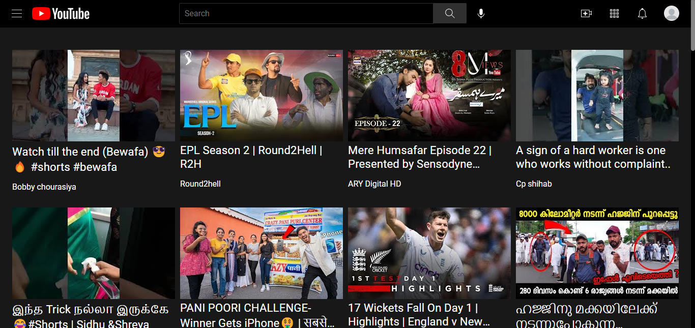
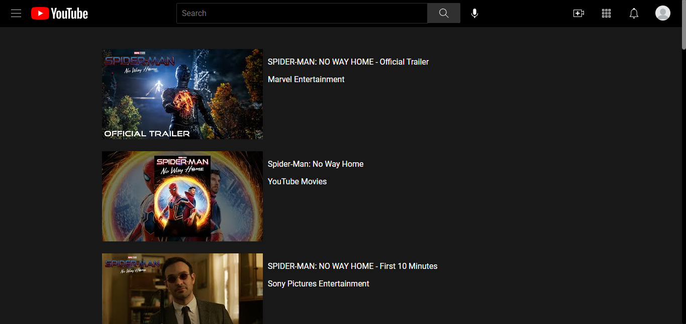
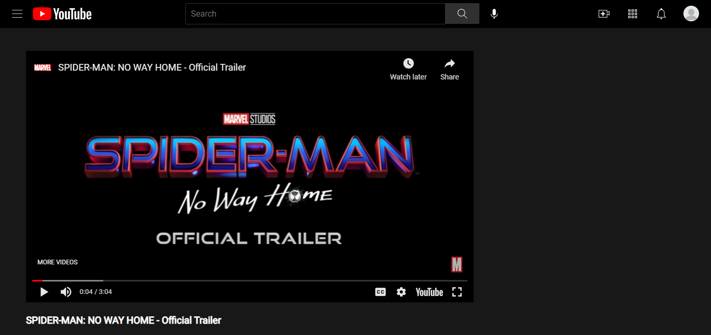

# Clone of Youtube

YouTube is an American online video sharing and social media platform headquartered in San Bruno, California.
This is one my side projects. In this project I tried to build erverything similar to youtube and I am happy with it. I think I 
learned alot from it. In the future I like to try more different things in my project and explore more.

here is the link to checkout the site - [click here](https://lambent-profiterole-7b09a2.netlify.app/).

## Tech Stack
- Javascript
- HTML
- CSS
- Youtube api

## Inspiration
- Youtube  [https://www.youtube.com/](https://www.youtube.com/)

## Features
- Home page for all tending videos
- Search functionality
- Search results page
- Individual video page
- Playable youtube videos

## Screenshots

## Conclusions
- I had so much fun building this website that I want to build some more. Even though I had to scrifice some of my free time to build it
  and during that time I had so many difficulties but i am so happy with it and I am so glad that I stuck through it and made to the end.

